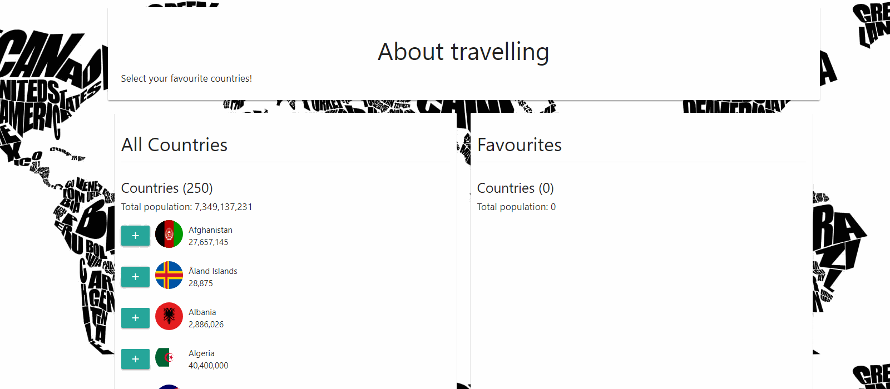

# Favourite countries

So you have traveled all over the world and now are in doubt about what are your favorite countries? Well, here is your solution =)

In this app you can click in the list of countries, select your favourite ones and render a new list with its total population. 
Awesome, isn't?

## Page Screen

 
 

## Tech stuff...

- This site was made using only HTML/ CSS and Vanilla Js
- <a href='http://restcountries.eu/'> restcountries.eu </a> is the awesome API used to get the list of countries used in this project!
